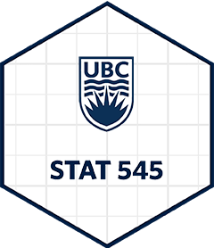

# Team20 Collaborative Project Milestone 2
## What is the *_Project_*?
The *_Project_* will include each team member to

* create a pull request that includes a start-up statement
* make a pull request
* review a pull request made by others and merge it
* ensure that pull requests previously graded are marked "(GRADED)" in the file name.

## What *_files_* are in the 'collaborative-team20' GitHub repository?
* README_2.md
* troubleshooting-2.md
* troubleshooting-2.Rmd
* teamwork progress tracking
* help requests from fellow team members

## How can you run *_codes_* that are in 'collaborative-team20' GitHub repository?
* make a backup copy of the code
* make sure you have the latest version of RStudio installed on the computer
* using RStudio, pull the file, make changes, commit, push/merge the file
* alternatively, you can work on the code using GitHub or jupyter 
   

- [x] https://github.com/stat545ubc-2023/collaborative-team20/issues/1
- [x] https://github.com/stat545ubc-2023/collaborative-team20/issues/2
- [x] https://github.com/stat545ubc-2023/collaborative-team20/issues/8

## **File list for this Project**

1. **[README_2.md](https://github.com/stat545ubc-2023/collaborative-team20/blob/main/README_2.md):** The README_2 file shows the outline of this project.
2. **[TEAMWORK-2.md](https://github.com/stat545ubc-2023/collaborative-team20/blob/main/(GRADED)%20TEAMWORK-2.md):** This TEAMWORK-2 file provides a guideline on how we collaborate and communicate among each other.
3. **[troubleshooting-2.Rmd](https://github.com/stat545ubc-2023/collaborative-team20/blob/main/troubleshooting-2.Rmd):** This is the STAT 545A Troubleshooting Exercise for Milestone 2.
4.  **[troubleshooting-2.md](https://github.com/stat545ubc-2023/collaborative-team20/blob/main/troubleshooting-2.md):** This is the markdown version of STAT 545A Troubleshooting Exercise for Milestone 2.
